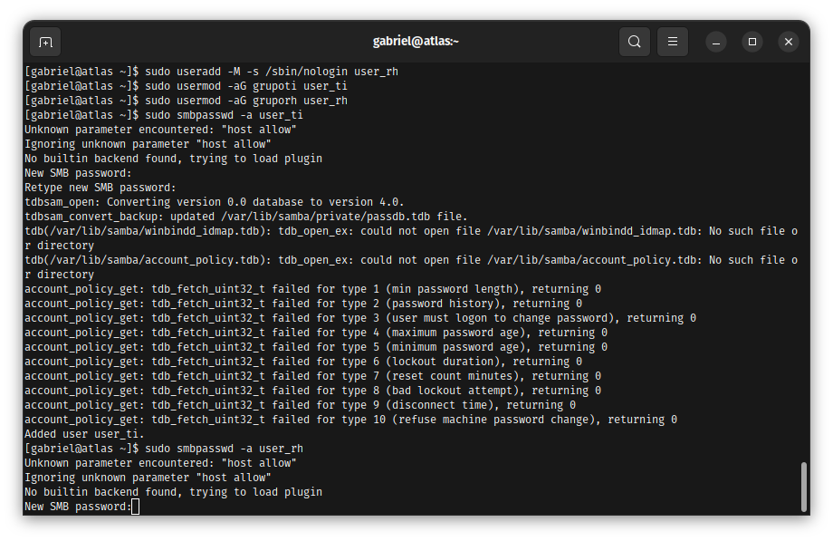
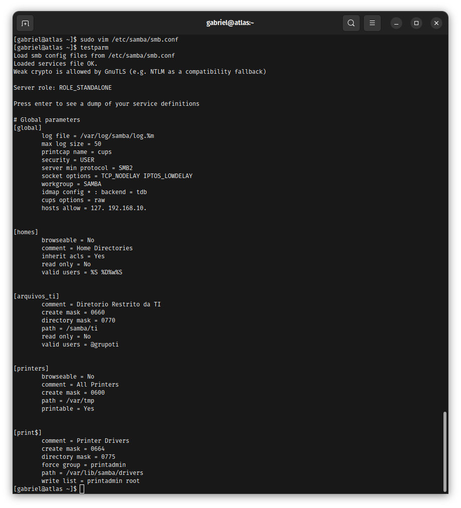

# Enterprise Edge & Services Infrastructure 🛡️

Este repositório documenta a implementação de uma infraestrutura corporativa completa, abrangendo desde serviços tradicionais de rede até orquestração de contêineres e automação (IaC). O foco contínuo é manter a governança de acesso e o hardening em todas as camadas.

## Roadmap de Implementação e Arquitetura

O ecossistema está sendo construído de forma modular, com as seguintes fases de implantação:

- [x] **Fase 1: Secure File Services** - Servidor Samba com permissões granulares e isolamento de rede.
- [x] **Fase 2: Relational Databases & Governance** - MariaDB (Atlas Server) com auditoria e automação Python.
- [x] **Fase 3: NoSQL & Scalability** - Implementação de MongoDB para documentos em XFS.
- [x] **Fase 4: Containerization & Isolation** - Empacotamento via Docker e isolamento de ambientes de desenvolvimento.
- [ ] **Fase 5: Cloud-Native & Orchestration** - Orquestração de microsserviços via Kubernetes.
- [ ] **Fase 6: Web, Comms & Observability** - Webservers Apache, VoIP com Asterisk e monitoramento centralizado com Prometheus.
- [ ] **Fase 7: Infrastructure as Code & Cache** - Automação com Ansible/Terraform e Cache de alta performance com Redis.
- [ ] **Fase 8: Enterprise Databases (Extra)** - Administração profunda de Oracle Database e PL-SQL.

---

## 📁 Fase 1: Samba Secure Storage (Concluído)

### Contexto do Problema
O ambiente corporativo demandava um servidor de arquivos centralizado capaz de isolar dados sensíveis entre grupos de usuários. A premissa técnica era garantir o serviço operando estritamente dentro das políticas ativas do SELinux e do Firewall corporativo.

### Troubleshooting e Resolução
Durante a homologação, identificou-se o erro `NT_STATUS_IO_TIMEOUT`.
* **Causa Raiz:** Host e VM em sub-redes distintas via NAT, causando descarte de pacotes.
* **Solução Aplicada:** Migração para modo Bridge, whitelisting no firewalld e ajuste de booleanos do SELinux.

### Evidência Técnica

**1. Acesso Efetivo e Permissões:**

  
📂 Clique para ver a validação de acesso Samba

  

**2. Hardening de Rede e Kernel:**

  
📂 Clique para ver a configuração de Firewall e SELinux

  
  

**3. Troubleshooting e Validação de Daemons:**

  
📂 Clique para ver o teste de sintaxe e validação

  
  

---

## 📁 Fase 2: Relational Databases & Governance (Concluído)

### Contexto do Problema
A infraestrutura necessitava de uma camada de persistência para dados sensíveis sob conformidade. O desafio era garantir proteção Data-at-Rest e rastreabilidade total de operações, impedindo acessos não autorizados mesmo por usuários com privilégios de sistema.

### Troubleshooting e Resolução (Integração Python)
Na automação do middleware, identificou-se o erro `Table doesn't exist` no script Python.
* **Causa Raiz:** Divergência de schema no Atlas Server após migração de tabelas criptografadas.
* **Solução Aplicada:** Hotfix via CLI do MariaDB para normalização do schema e implementação de blocos try/except no Python para garantir resiliência e logs de erro limpos.

### Evidência Técnica

**1. Proteção de Dados (Criptografia AES):**

  
📂 Clique para ver a criptografia AES no banco

  

**2. Observabilidade (Auditoria em Tempo Real):**

  
📂 Clique para ver o log de auditoria do MariaDB

  

**3. Automação e Resiliência (Python Integration):**

  
📂 Clique para ver a integração Python com MariaDB

  

### Conclusão de Valor
A arquitetura do Atlas Server assegura integridade e confidencialidade. A integração com Python permite escalar processos automatizados mantendo o rigor de segurança exigido em infraestruturas corporativas modernas.

---

## 📁 Fase 3: NoSQL & Scalability (Concluído)

### Contexto do Problema
A infraestrutura necessitava de um banco NoSQL para persistência de dados não estruturados de alta volumetria. O desafio técnico era garantir a instalação do MongoDB 7.0 no Rocky Linux sob um sistema de arquivos otimizado (XFS) e com autenticação RBAC habilitada.

### Troubleshooting e Resolução
* **Causa Raiz:** O motor de armazenamento padrão do MongoDB (WiredTiger) exige alta performance de I/O e consistência de bloco. O EXT4 tradicional poderia gerar overhead no escalonamento.
* **Solução Aplicada:** Formatação da partição dedicada em XFS, tuning do arquivo `mongod.conf` e amarração do serviço para escutar apenas interfaces seguras da rede local.

### Evidência Técnica

**1. Tuning de Storage (WiredTiger + XFS):**

  
📂 Clique para ver a montagem XFS e WiredTiger

  

**2. Agregação Avançada e Correlação de Dados ($lookup):**

  
📂 Clique para ver a query de agregação de segurança

  

---

## 📁 Fase 4: Containerization & Isolation (Concluído)

### Contexto do Problema
Para isolar ambientes de desenvolvimento e testes, era necessário conteinerizar a stack do MongoDB sem conflitar com as portas nativas e serviços preexistentes do Rocky Linux.

### Troubleshooting e Resolução
Durante o provisionamento do daemon do Docker, o gerenciador de pacotes padrão (`dnf`) falhou ao tentar buscar os pacotes comunitários.
* **Causa Raiz:** Repositórios oficiais do Docker não vêm habilitados por padrão no Rocky Linux.
* **Solução Aplicada:** Ingestão do repositório oficial do Docker (compatível via branch CentOS/RHEL) no Rocky Linux via dnf config-manager, garantindo o pull da imagem oficial. Exposição controlada da porta 27018

### Evidência Técnica

**1. Autenticação e Isolamento de Contêineres:**

  
📂 Clique para ver a autenticação no MongoDB conteinerizado

  

**2. Otimização de I/O via Operações em Lote (BulkWrite):**

  
📂 Clique para ver as operações de BulkWrite performáticas

  

**3. Troubleshooting de Conflito de Portas no Daemon:**

  
📂 Clique para ver a resolução de conflito da porta 27018

  

### Conclusão de Valor
A união do MongoDB nativo em XFS com instâncias conteinerizadas em Docker fornece à arquitetura do projeto elasticidade para microsserviços e robustez de armazenamento para big data tradicional.
