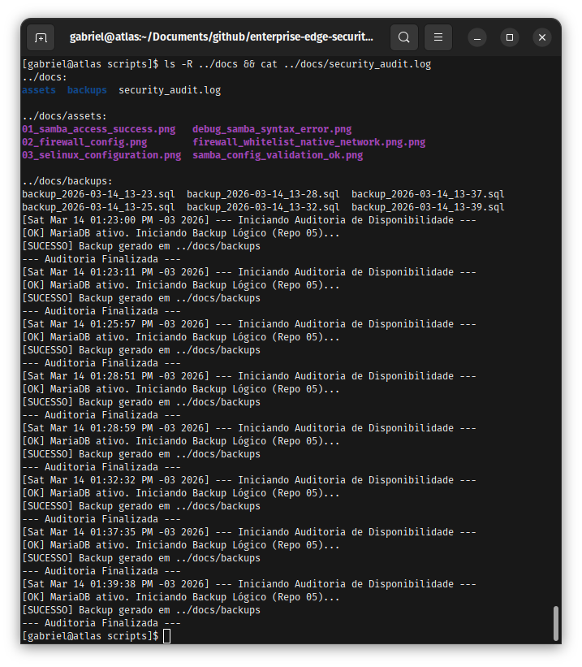
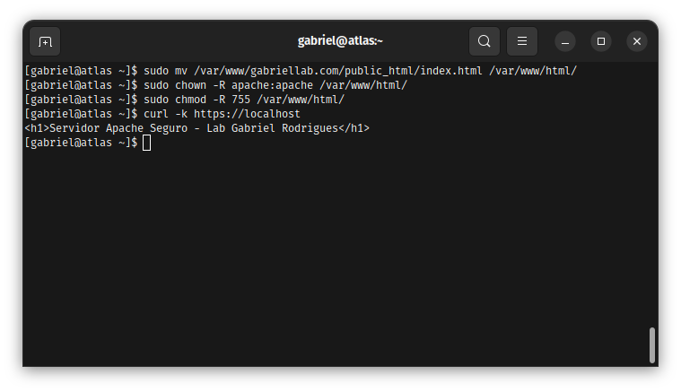

# Enterprise Edge & Services Infrastructure 🛡️

Este repositório documenta a implementação de uma infraestrutura corporativa completa, abrangendo desde serviços tradicionais de rede até orquestração de contêineres e automação (IaC). O foco contínuo é manter a governança de acesso e o hardening em todas as camadas.

## Roadmap de Implementação e Arquitetura
O ecossistema está sendo construído de forma modular, com as seguintes fases de implantação:

- [x] **Fase 1: Secure File Services** - Servidor Samba com permissões granulares e isolamento de rede.
- [x] **Fase 2: Relational Databases & Governance** - MariaDB (Atlas Server) com auditoria e automação Python.
- [x] **Fase 3: NoSQL & Scalability** - MongoDB 8.0 (XFS) + Ciclo de Vida (TTL) + Transações Atômicas.
- [x] **Fase 4: Containerization & Isolation** - Docker + Troubleshooting de Portas + RBAC.
- [x] **Fase 5: Infrastructure as Code & Cloud Scalability** - Automação com Terraform, provisionamento na AWS.
- [x] **Fase 6: Enterprise Automation & Configuration** - Gerenciamento de configuração com Ansible.
- [x] **Fase 7: Cloud-Native & Orchestration** - Orquestração via Kubernetes (K3s).
- [ ] **Fase 8: Web Services & Comms** - Hardening de Apache (Seção 40) e VoIP com Asterisk.
- [ ] **Fase 9: Enterprise Databases & Cache** - Administração de Oracle/PL-SQL e Cache com Redis.

## Ambiente de Desenvolvimento
Para a orquestração e gerenciamento da infraestrutura, foi utilizada uma arquitetura híbrida:

* **OS Nativo (Ubuntu 24.04 LTS):** Estação principal para ferramentas CLI (Terraform, AWS CLI) e Orquestração (K3s).
* **Virtualization (Rocky Linux 9):** Servidor de serviços críticos (Samba, MongoDB, MariaDB) para simular ambientes corporativos.
* **IaC Engine:** Terraform v1.x para automação multi-cloud.
* **Interface:** VS Code com extensões HCL e YAML para validação de sintaxe.

---

## 📁 Fase 1: Samba Secure Storage (Concluído)

### Evidência Técnica
**1. Acesso Efetivo e Permissões:**

  
📂 Clique para ver a validação de acesso Samba

  

**2. Hardening de Rede e Kernel:**

  
📂 Clique para ver a configuração de Firewall e SELinux

  
  

---

## 📁 Fase 2: Relational Databases & Governance (Concluído)

### Evidência Técnica
**1. Proteção de Dados e Automação:**

  
📂 Clique para ver a criptografia AES e Integração Python

  
  

**2. Recuperação Crítica e Auditoria:**

  
📂 Clique para ver o log de comandos de recovery e auditoria

  
  
  

---

## 📁 Fase 3: NoSQL & Scalability (Concluído)

### Evidência Técnica
**1. Tuning de Storage & Performance:**

  
📂 Clique para ver a arquitetura XFS e Índices

  
  

**2. Governança e Ciclo de Vida:**

  
📂 Clique para ver TTL e Agregações

  
  

---

## 📁 Fase 4: Containerization & Isolation (Concluído)

### Evidência Técnica
**1. Autenticação e Operações em Lote:**

  
📂 Clique para ver a autenticação Docker e BulkWrite

  
  

---

## 📁 Fase 5: Infrastructure as Code & Cloud Scalability (Concluído)

### Evidência Técnica
**1. Orquestração Terraform:**

  
📂 Clique para ver o Plan e Apply

  
  

---

## 📁 Fase 6: Enterprise Automation & Configuration (Concluído)

### Evidência Técnica
**1. Gestão de Configuração e Conectividade:**

  
📂 Clique para ver o Setup e Conexão Ansible

  
  

**2. Segurança e Auditoria Final:**

  
📂 Clique para ver o Hardening com Vault e Relatórios

  
  

---

## 📁 Fase 7: Cloud-Native & Orchestration (Concluído)

### Evidência Técnica
**1. Deploy e Resiliência:**

  
📂 Clique para ver o Cluster e Auto-Healing

  
  

**2. Investigação e Troubleshooting:**

  
📂 Clique para ver a resolução de bloqueios de sistema

  
  

> [!IMPORTANT]
> **Lição Aprendida: VIM vs. IDE**
> Embora o VIM seja vital para ajustes rápidos, para manifestos Kubernetes (YAML) e Terraform, a IDE (VS Code) é mandatória para evitar erros de indentação fatais ao deploy.

---

## 📁 Segurança de Identidade & Hardening de Sistema (Concluído)

### Evidência Técnica
**1. Gestão de Identidades e RBAC:**

  
📂 Clique para ver as políticas de segurança

  
  

**2. Resiliência e Auditoria Root:**

  
📂 Clique para ver auditoria e hardening

  
  
  

---

### Conclusão de Valor
A integração de IaC (Terraform), Automação (Ansible) e Orquestração (Kubernetes) garante uma infraestrutura resiliente, escalável e auditável para operações críticas.
