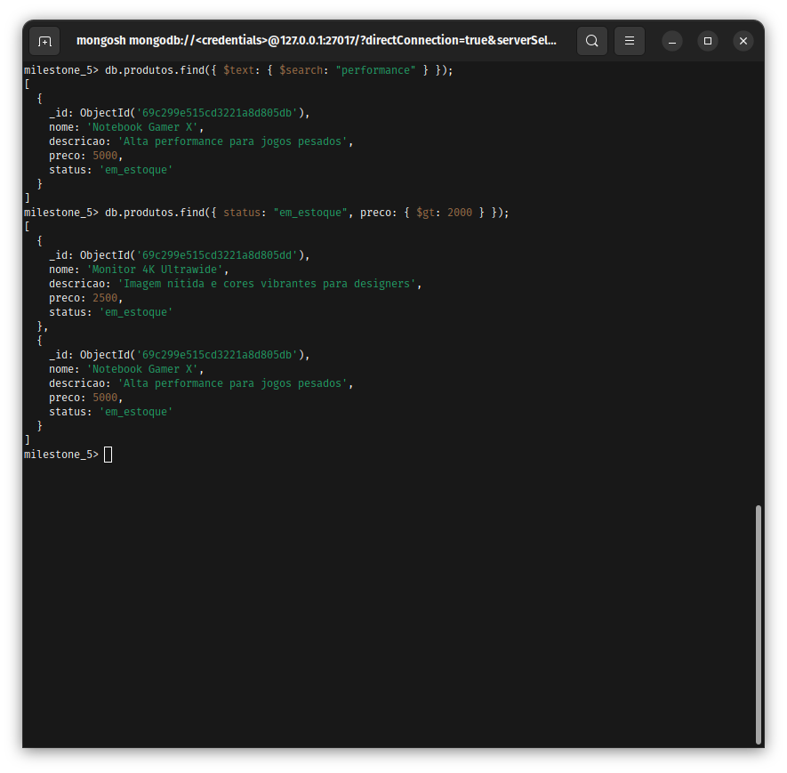
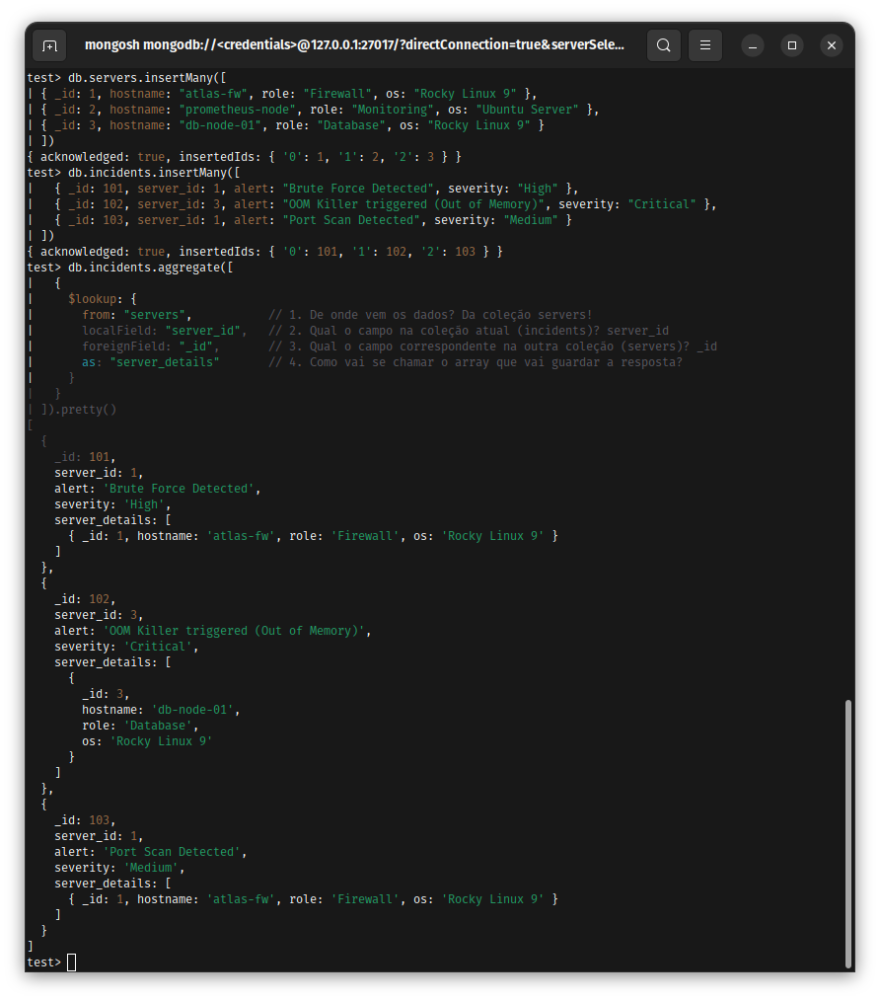
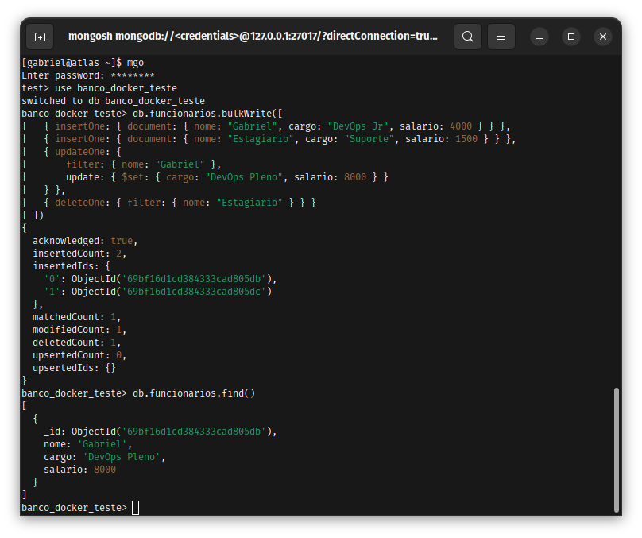
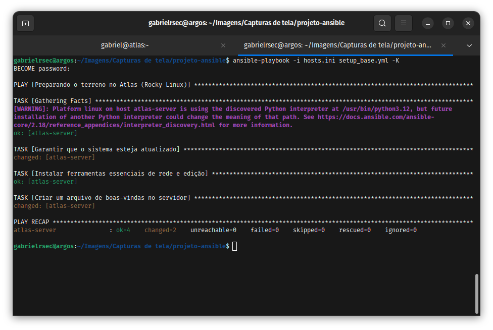
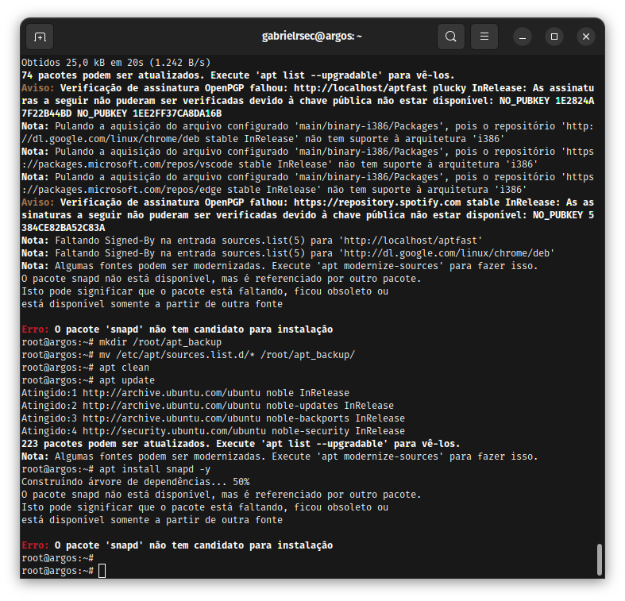
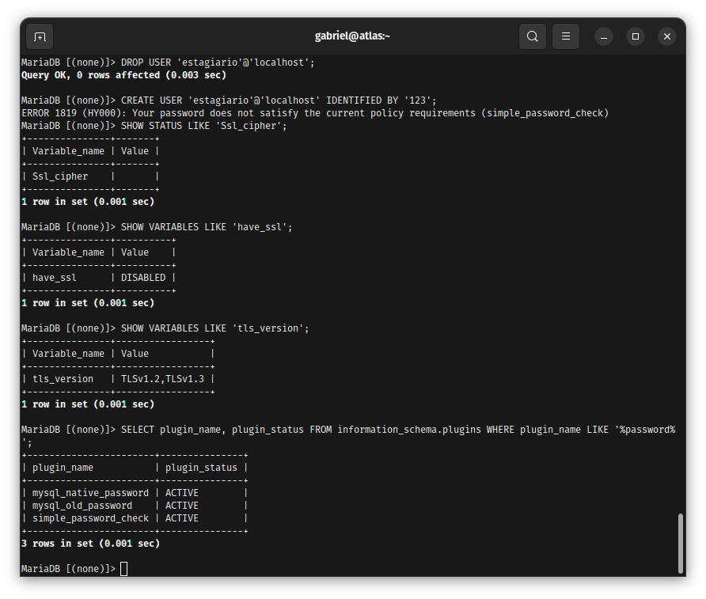
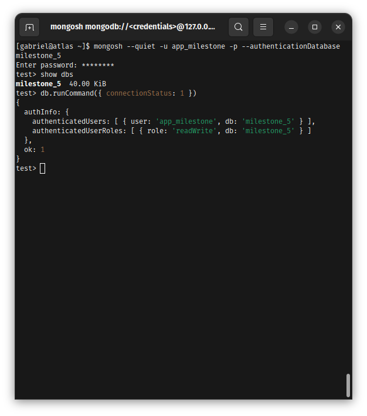
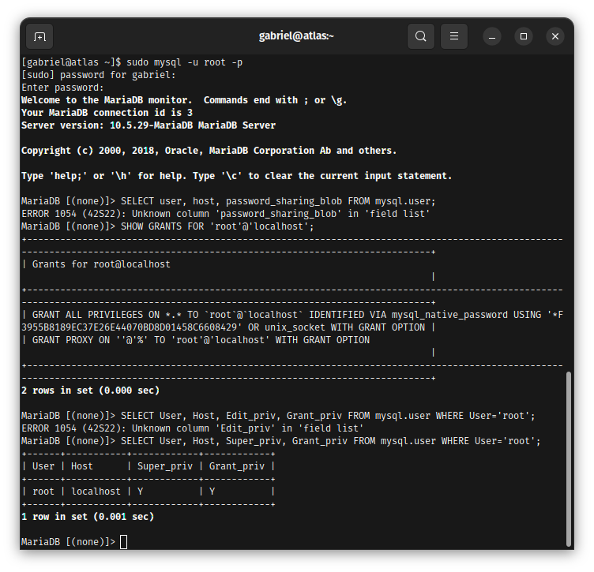

# Enterprise Edge & Services Infrastructure 🛡️

Este repositório documenta a implementação de uma infraestrutura corporativa completa, abrangendo desde serviços tradicionais de rede até orquestração de contêineres e automação (IaC). O foco contínuo é manter a governança de acesso e o hardening em todas as camadas.

## Roadmap de Implementação e Arquitetura
O ecossistema está sendo construído de forma modular, com as seguintes fases de implantação:

- [x] **Fase 1: Secure File Services** - Servidor Samba com permissões granulares.
- [x] **Fase 2: Relational Databases & Governance** - MariaDB com auditoria e Python.
- [x] **Fase 3: NoSQL & Scalability** - MongoDB 8.0 (XFS) + Ciclo de Vida (TTL).
- [x] **Fase 4: Containerization & Isolation** - Docker + Troubleshooting de Portas.
- [x] **Fase 5: Infrastructure as Code & Cloud Scalability** - Terraform + AWS Load Balancer.
- [x] **Fase 6: Enterprise Automation & Configuration** - Automação com Ansible.
- [x] **Fase 7: Cloud-Native & Orchestration** - Orquestração via Kubernetes (K3s).
- [ ] **Fase 8: Web Services & Comms** - Hardening de Apache e VoIP Asterisk.
- [ ] **Fase 9: Enterprise Databases & Cache** - Oracle/PL-SQL e Redis.

## Ambiente de Desenvolvimento
* **OS:** Ubuntu 24.04 LTS (Argos) - Ambiente nativo para execução de ferramentas CLI.
* **Virtualization (Rocky Linux 9/Enterprise Linux):** Utilizado como servidor de serviços críticos (Samba, MongoDB, MariaDB) para simular ambientes corporativos isolados via VMware/VirtualBox.
* **IaC Engine:** Terraform v1.x (HashiCorp) para automação multi-cloud.
* **Interface:** VS Code com extensões HCL para validação de sintaxe.
* **Connectivity:** AWS CLI v2 configurado com políticas de acesso restrito (IAM).

---

## 📁 Fase 1: Samba Secure Storage (Concluído)

### Contexto do Problema
Demanda por servidor de arquivos centralizado isolando dados sensíveis. Premissa: operar sob políticas rigorosas de SELinux e Firewall.

### Troubleshooting e Resolução
Erro `NT_STATUS_IO_TIMEOUT` devido a isolamento de rede NAT.
* **Solução:** Migração para modo Bridge e whitelisting no firewalld.

### Evidência Técnica
**1. Acesso Efetivo:**

  
📂 Ver validação de acesso Samba

  

**2. Hardening:**

  
📂 Ver Firewall e SELinux

  
  

---

## 📁 Fase 2: Relational Databases & Governance (Concluído)

### Contexto do Problema
Necessidade de camada de persistência com Data-at-Rest e rastreabilidade total.

### Troubleshooting (Critical Recovery)
Falha de socket no MariaDB e divergência de schema na automação Python.
* **Solução:** Limpeza de arquivos de log, reset de permissões em `/var/lib/mysql` e hotfix try/except no Python.

### Evidência Técnica
**1. Proteção e Integração:**

  
📂 Ver Criptografia AES e Python

  
  

**2. Recuperação e Auditoria:**

  
📂 Ver Recovery e Auditoria

  
  

---

## 📁 Fase 3: NoSQL & Scalability (Concluído)

### Contexto do Problema
MongoDB 8.0 no Rocky Linux sob XFS e autenticação RBAC.

### Evidência Técnica
**1. Performance:**

  
📂 Ver XFS e Índices

  
  

**2. Ciclo de Vida:**

  
📂 Ver TTL e Agregações

  
  

---

## 📁 Fase 4: Containerization & Isolation (Concluído)

### Contexto do Problema
Conteinerização da stack MongoDB para isolamento e portabilidade.

### Evidência Técnica
**1. Autenticação e Lote:**

  
📂 Ver Auth Docker e BulkWrite

  
  

---

## 📁 Fase 5: Infrastructure as Code & Cloud Scalability (Concluído)

### Contexto do Problema
Padronização de recursos AWS (us-east-1) via Terraform.

### Troubleshooting
Erro `503 Service Unavailable` no Load Balancer inicial.
* **Causa Raiz:** Latência no Health Check vs script de User Data.
* **Solução:** Refatoração do script e ajuste nos Security Groups para o ELB.

### Evidência Técnica
**1. Orquestração:**

  
📂 Ver Plan e Apply

  
  

---

## 📁 Fase 6: Enterprise Automation & Configuration (Concluído)

### Contexto do Problema
Padronização do hardening e instalação de serviços em escala via **Ansible**.

### Diferenciais Técnicos
* **Ansible Vault:** Proteção de segredos via criptografia.
* **Idempotência:** Scripts que garantem o estado final sem redundância.

### Evidência Técnica
**1. Gestão e Conectividade:**

  
📂 Ver Conexão e Setup

  
  

**2. Segurança:**

  
📂 Ver Hardening Vault e Auditoria

  
  

---

## 📁 Fase 7: Cloud-Native & Orchestration (Concluído)

### Contexto do Problema
Orquestração via Kubernetes (K3s) em Bare Metal (Ubuntu Nativo), com foco em Auto-healing.

### Troubleshooting (Sistema de Arquivos)
Bloqueios de escrita e atributos de imutabilidade no Ubuntu experimental.
* **Solução:** Investigação via `lsattr` e remoção de travas com `chattr -i`.

### Evidência Técnica
**1. Deploy e Resiliência:**

  
📂 Ver Cluster e Auto-Healing

  
  

**2. Investigação Técnica:**

  
📂 Ver Bloqueios e Sanitização APT

  
  

> [!IMPORTANT]
> **Lição Aprendida: VIM vs. IDE**
> Embora o VIM seja vital para ajustes rápidos em servidor, para manifestos K8s e Terraform, a IDE (VS Code) é recomendável para evitar erros de indentação (YAML) invisíveis no terminal.

---

## 📁 Segurança de Identidade & Hardening de Sistema (Concluído)

### Evidência Técnica

  
📂 Ver Políticas de RBAC e Auditoria Root

  
  
  
  

---

### Conclusão de Valor
A integração de IaC (Terraform), Automação (Ansible) e Orquestração (Kubernetes) com políticas rigorosas de Hardening garante uma infraestrutura resiliente, escalável e auditável para operações críticas.
