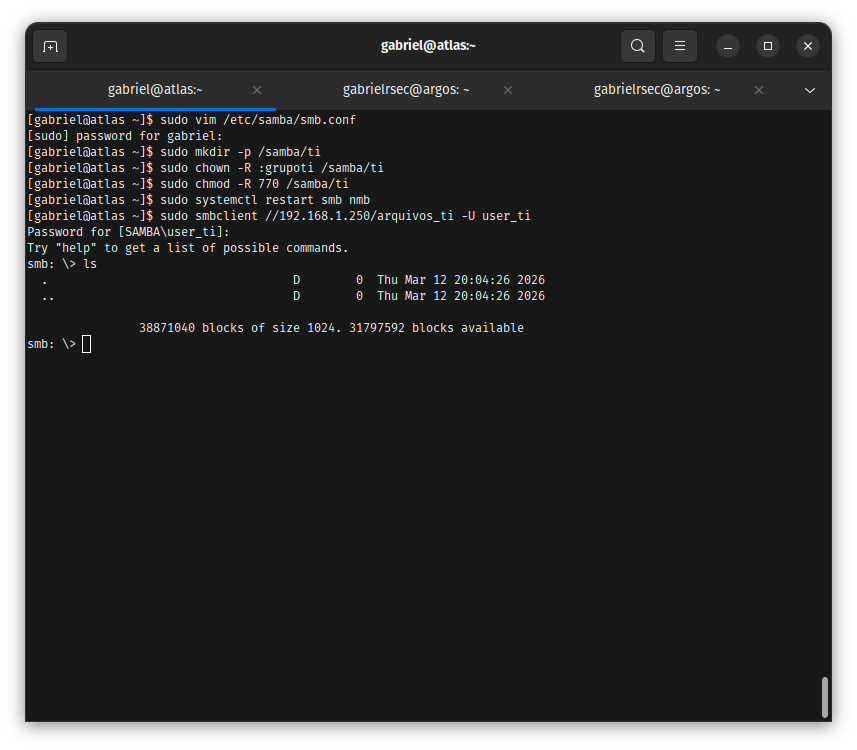
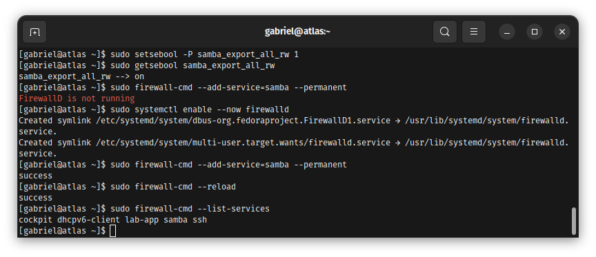
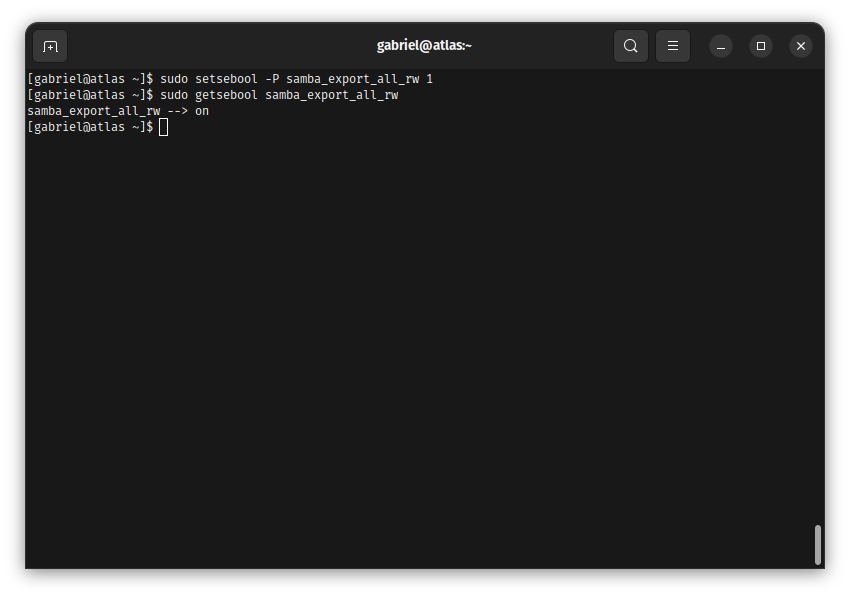

# Enterprise Edge & Services Infrastructure 🛡️ 

Este repositório documenta a implementação de uma infraestrutura corporativa completa, abrangendo desde serviços tradicionais de rede e comunicação até orquestração de contêineres e automação (IaC). O foco contínuo é manter a governança de acesso e o hardening em todas as camadas.

## Roadmap de Implementação e Arquitetura

O ecossistema está sendo construído de forma modular, com as seguintes fases de implantação:

- [x] **Fase 1: Secure File Services** - Servidor Samba com permissões granulares e isolamento de rede.
- [ ] **Fase 2: Web & Comms** - Hospedagem com Apache e infraestrutura de VoIP corporativo com Asterisk.
- [ ] **Fase 3: Containerization & Orchestration** - Empacotamento via Docker e gestão de microsserviços com cluster Kubernetes.
- [ ] **Fase 4: Infrastructure as Code - IaC** - Automação de provisionamento e gerência de configuração usando Ansible e Terraform.
- [ ] **Fase 5: Database Systems & Caching** - Implantação de bancos relacionais (MySQL, Oracle DB/PL-SQL), NoSQL (MongoDB) e instâncias de cache em memória (Redis).

---

## 📁 Fase 1: Samba Secure Storage (Concluído)

### Contexto do Problema
O ambiente corporativo demandava um servidor de arquivos centralizado capaz de isolar dados sensíveis entre grupos de usuários (ex: TI vs. RH). A premissa técnica era garantir o serviço operando estritamente dentro das políticas ativas do SELinux (Enforcing) e do Firewall corporativo, sem contornar as camadas de segurança do SO.

### 🛠️ Troubleshooting e Resolução
Durante a homologação, a tentativa de acesso via cliente SMB retornou o erro `NT_STATUS_IO_TIMEOUT`. 
* **Causa Raiz:** O host de acesso e a instância virtualizada operavam em sub-redes distintas devido ao NAT padrão do hypervisor, o que causava o descarte de pacotes nas portas TCP 139/445.
* **Solução Aplicada:** A interface de rede foi migrada para o modo **Bridge**, alinhando os domínios de broadcast. Em seguida, foi aplicado um whitelisting no `firewalld` e ativados os booleanos específicos do Kernel para compartilhamento de diretórios.

### 📸 Evidência Técnica

**1. Acesso Efetivo e Permissões:**
Validação de conectividade externa e listagem do diretório, confirmando a ACL do grupo autorizado.

**2. Hardening de Rede (Firewalld):**
Liberação persistente do serviço Samba, mantendo portas não essenciais bloqueadas.

**3. Hardening de Kernel (SELinux):**
Ativação da política `samba_export_all_rw` para permitir escrita sem rebaixar a segurança do sistema.

### Conclusão de Valor
A implementação assegura a integridade e a confidencialidade dos dados entre departamentos, mitiga o risco de acessos laterais através de políticas estritas de rede e SO, e cria uma base escalável para auditorias de conformidade.

---

## 📁 Fase 2: Web & Comms (Em Breve)
*(Aguardando implementação do Apache e Asterisk)*
